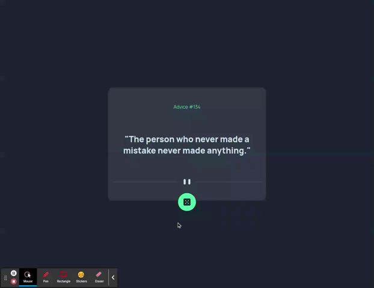

# Advice Generator

An application used to generate advices with data from [Advice Slip API](https://api.adviceslip.com/), built with React, TypeScript, axios.

## Frontend Mentor:

This project was been developed based on [Frontend Mentor](https://www.frontendmentor.io/challenges/advice-generator-app-QdUG-13db) description and definitions

## Running application

```bash
yarn # for install all dependencies
```

```bash
yarn start # for run application on port 3000
```

```bash
yarn test # for run unit tests
```

```bash
yarn build # for build application for production
```

<div align="center">
  <h2>Project demo</h2>

  
</div>

