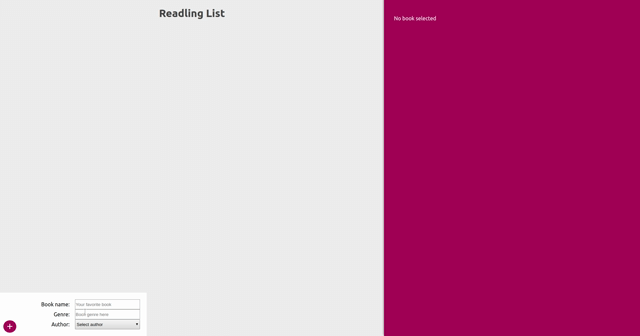

# React Readlist :notebook_with_decorative_cover:

Application made with react and graphql for study

## Back-end:
- [NodeJs](https://nodejs.org/en/);
- [graphql](https://graphql.org/);
- [express](https://expressjs.com/pt-br/);
- [mongodb](https://www.mongodb.com/);
- [mongoose](https://mongoosejs.com/).

## Front-end:
- [React](https://pt-br.reactjs.org/);
- [graphql](https://graphql.org/);
- [react-apollo](https://www.apollographql.com/docs/react/).

Application Builted with this [tutorial](https://www.youtube.com/watch?v=Y0lDGjwRYKw&list=PL4cUxeGkcC9iK6Qhn-QLcXCXPQUov1U7f) but with [React Hooks](https://pt-br.reactjs.org/docs/hooks-intro.html)

## Run application
- Running application `docker-compose --build`

<h1 align="center">Interface example</h1>

	

